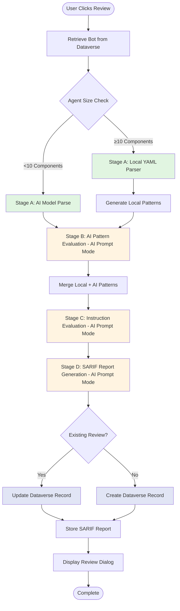
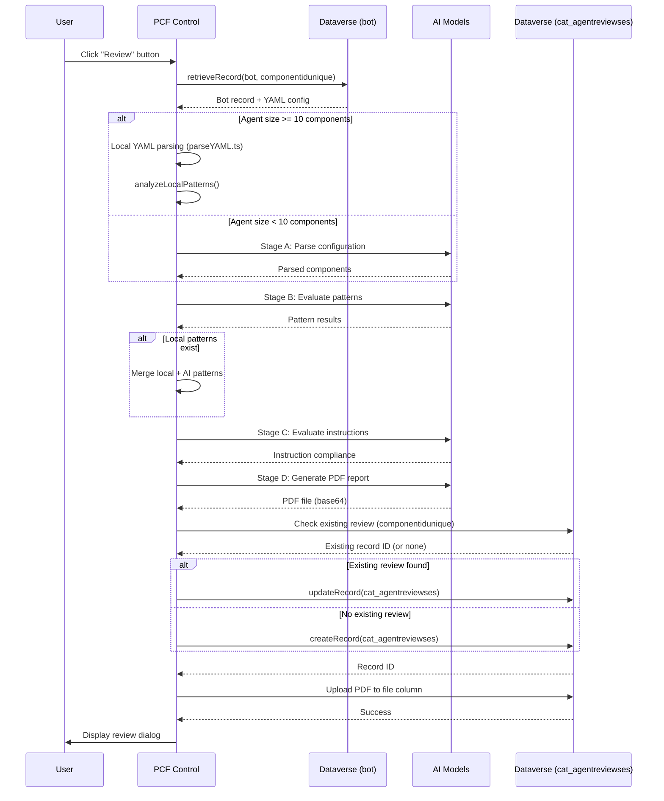

# Copilot Studio Agent Optimizer - Technical Documentation

## Overview

This Power Apps Component Framework (PCF) control provides automated quality assessment and compliance review for Copilot Studio agents. It analyzes agent configurations, evaluates best practice patterns, and generates comprehensive reports.

**Key Capabilities:**
- Parse and analyze Copilot Studio agent YAML configurations
- Evaluate pattern compliance (model setup, variables, test cases)
- Assess agent instruction quality and compliance
- Generate SARIF reports with findings and recommendations
- Store review results in Dataverse for historical tracking

**Runtime Mode:** All AI stages (B, C, D) use **AI Prompt mode** (`runtime: null`) for context-aware, dynamic analysis.

---

## Review Flow Architecture

### High-Level Process



---

## Review Stages Breakdown

### Stage A: Configuration Parsing
**Purpose:** Extract structured data from agent YAML configuration

**Input:**
- Bot record from `bot` table (via `componentidunique`)
- YAML configuration from `bot.configuration` field

**Processing Logic:**
```
IF agent has >= 10 components THEN
    Use local YAML parser (parseYAML.ts + extractStageAData.ts)
    - Faster execution
    - Deterministic pattern detection
    - Parse: topics, variables, model config, tools, knowledge sources
ELSE
    Call AI Model (Stage A prompt) - AI Prompt Mode
    - More flexible parsing
    - Handles edge cases
    - Same output structure
END IF
```

**Output Structure:**
```typescript
{
  AgentName: string
  Components: [
    {
      TopicName: string
      AgentInstructions?: string
      ModelName?: string
      ModelDescription?: string
      Variables: [
        { VariableName: string, VariableDescription?: string }
      ]
      Conditions: string[]
      Tools: [{ item: string }]
      KnowledgeSources: [{ item: string }]
    }
  ]
  MissingFields: {
    TopicsWithMissingModelName: string[]
    TopicsWithMissingModelDescription: string[]
    TopicsWithMissingInputVariableName: [{ topic, variable }]
    TopicsWithMissingInputVariableDescription: [{ topic, variable }]
    TopicsWithMissingOutputVariableName: [{ topic, variable }]
    TopicsWithMissingOutputVariableDescription: [{ topic, variable }]
    MissingTestCases: boolean
  }
}
```

---

### Stage B: Pattern Evaluation (AI Prompt Mode)
**Purpose:** Validate agent configuration against best practices using context-aware AI analysis

**Input:**
- Stage A parsed configuration as JSON string (`botcomponents`)
- Runtime mode: AI Prompt (`runtime: null`)

**AI Pattern Evaluation:**
- Calls AI model with Stage A output in AI Prompt mode
- Receives dynamic, context-aware pattern evaluation
- Evaluates 6 clarity patterns:
  1. Unclear Model Name
  2. Unclear Model Description
  3. Unclear Input Variable Name
  4. Unclear Input Variable Description
  5. Unclear Output Variable Name
  6. Unclear Output Variable Description

**Key Features:**
- Dynamic suggestions based on topic purpose
- Context-aware recommendations (not generic)
- Natural language reasoning
- First flagged topic used in examples

**Output Structure:**
```typescript
{
  Patterns: [
    {
      PatternName: string
      PatternDescription: string
      Status: boolean  // true = No issues, false = Issues found
      Topics: [
        {
          item: string  // Topic name
          current?: string  // Current unclear value
          suggested?: string  // AI-generated suggestion
          variable?: string  // Variable name (for variable patterns)
        }
      ]
      Recommendation: string  // Dynamic with actual examples
    }
  ]
}
```

---

### Stage C: Instruction Evaluation (AI Prompt Mode)
**Purpose:** Assess quality and compliance of agent instructions using context-aware AI analysis

**Input:**
- Agent instruction text (`Instruction_20Input`)
- Runtime mode: AI Prompt (`runtime: null`)

**Processing:**
- AI model analyzes instruction text in AI Prompt mode
- Evaluates 12 authoring best practices:
  1. Scope Definition
  2. Out-of-Scope Handling
  3. Persona & Tone
  4. Privacy & Sensitive Data
  5. Fallback When Uncertain
  6. Citations & Sources
  7. Formatting Guidelines
  8. Clarifying Questions
  9. Prompt Injection Resilience
  10. Link Safety
  11. Advice Disclaimers
  12. Accuracy & Quality Emphasis

**Key Features:**
- References actual instruction content (word count, domains, phrases)
- Domain detection (health, legal, finance, etc.)
- Geographic awareness (India, US, UK, etc.)
- Severity adjusts based on domain sensitivity
- Context-specific recommendations

**Output Structure:**
```typescript
{
  compliance: boolean  // true if >= 60%
  compliancePercentage: number  // 0-100
  issues: [
    {
      id: string  // kebab-case
      severity: 'high' | 'medium' | 'low'
      description: string  // References actual instruction
      guidelineReference: string
      recommendation: string  // Context-aware with examples
    }
  ]
  summary: string  // Multi-sentence dynamic summary
}
```

---

### Stage D: SARIF Report Generation (AI Prompt Mode)
**Purpose:** Create standardized SARIF report for tooling integration

**Input:**
- Stage A: Bot components
- Stage B: Pattern evaluation
- Stage C: Instruction evaluation
- Runtime mode: AI Prompt (`runtime: null`)

**Processing:**
- AI model generates SARIF 2.1.0 compliant report
- Maps Stage B & C findings to SARIF rules and results
- Includes locations, severity levels, and remediation guidance

**Output:**
```typescript
{
  version: "2.1.0"
  runs: [
    {
      tool: {
        driver: {
          name: "Copilot Studio Agent Optimizer"
          version: string
          rules: Rule[]  // Pattern and instruction rules
        }
      }
      results: Result[]  // Findings with locations
    }
  ]
}
```
{
  files: [
    {
      base64_content: string
      file_name: string
      content_type: 'application/pdf'
    }
  ]
}
```

---

## Dataverse Integration

### Tables Used

#### 1. **bot** (Source Table - Read Only)
**Purpose:** Copilot Studio agents metadata

**Key Fields Used:**
- `componentidunique` (string): Unique identifier for matching
- `name` (string): Agent display name
- `botid` (string): Bot identifier
- `configuration` (string): YAML configuration
- `componenttype` (number): Component type filter

**Query Pattern:**
```typescript
webAPI.retrieveMultipleRecords(
  'bot',
  '?$select=name,botid,componentidunique,configuration' +
  '&$filter=componenttype eq 6'  // Copilot Studio agents only
)
```

---

#### 2. **cat_agentreviewses** (Target Table - Read/Write)
**Purpose:** Store review results and historical data

**Key Fields:**
| Field Name | Type | Purpose |
|------------|------|---------|
| `cat_agentreviewsid` | GUID | Primary key |
| `cat_name` | String | Review display name |
| `cat_botid` | String | Bot ID reference |
| `cat_botname` | String | Bot name (denormalized) |
| `cat_componentidunique` | String | **Matching key** to bot table |
| `cat_overallscore` | Number | Combined quality score (0-100) |
| `cat_patternscore` | Number | Pattern compliance score (0-100) |
| `cat_instructionscore` | Number | Instruction quality score (0-100) |
| `cat_totalpatterns` | Number | Total patterns evaluated |
| `cat_passedpatterns` | Number | Passed patterns count |
| `cat_failedpatterns` | Number | Failed patterns count |
| `cat_totalissues` | Number | Total issues found |
| `cat_highseverityissues` | Number | High severity issues count |
| `cat_reviewresultjson` | Multiline Text | Complete review JSON (Legacy - see cat_reviewresultfile) |
| `cat_reviewresultfile` | File | Review result JSON file (bypasses 1MB limit) |
| `cat_reviewdate` | DateTime | Review timestamp |
| `cat_reviewstatus` | Choice | 335350000 = Completed |
| `cat_reviewpdfreport` | File | PDF report (base64) |
| `cat_reviewpdfreport_name` | String | PDF filename |

**Create/Update Logic:**
```typescript
// Check if review exists
const existingReview = existingReviews.get(bot.componentidunique);
const existingRecordId = existingReview?.cat_agentreviewsid;

if (existingRecordId) {
    // Update existing record
    await webAPI.updateRecord('cat_agentreviewses', existingRecordId, reviewData);
} else {
    // Create new record
    const recordId = await webAPI.createRecord('cat_agentreviewses', reviewData);
}
```

**Matching Strategy:**
- `bot.componentidunique` → `cat_agentreviewses.cat_componentidunique`
- Ensures one-to-one mapping (latest review per agent)
- Update overwrites previous review data

---

## Review Workflow Sequence Diagram



---

## Score Calculation Logic

### Overall Score
```typescript
overallScore = (patternScore * 0.5) + (instructionScore * 0.5)
// 50% weight to pattern compliance
// 50% weight to instruction quality
```

### Pattern Score
```typescript
patternScore = (passedPatterns / totalPatterns) * 100
// Based on count of passed vs total patterns
```

### Instruction Score
```typescript
instructionScore = compliancePercentage
// Directly from Stage C AI evaluation (0-100)
```

---

## Key Functions Reference

### BotsDataGrid.tsx
- **handleReview()**: Orchestrates 4-stage review process
- **handleViewReview()**: Loads and displays existing review
- **handleDownloadReport()**: Downloads PDF from Dataverse
- **filterBots()**: Applies search and status filters
- **loadExistingReviews()**: Fetches completed reviews

### Services
- **retrieveBots.ts**: Fetches agents from bot table
- **retrieveAgentReviews.ts**: Fetches reviews from cat_agentreviewses
- **saveReviewRecord.ts**: Creates/updates review records
- **retrievePromptResponse.ts**: Calls AI models (Stages A-D)
- **parseYAML.ts**: Local YAML configuration parser
- **extractStageAData.ts**: Local Stage A data extraction + pattern analysis

---

## Error Handling

**Stage Failures:**
- Each stage wrapped in try-catch
- Errors logged to console
- UI displays error message
- Partial results saved when possible

**PDF Generation Failure:**
- Review continues without PDF
- Record saved with scores and JSON
- User can re-run review to regenerate PDF

**Dataverse Save Failure:**
- Error displayed to user
- Review results retained in memory
- Dialog still opens for viewing

---

## Performance Considerations

**Local vs AI Parsing:**
- Threshold: 10 components
- Local parsing: ~1-2 seconds
- AI parsing: ~5-10 seconds per stage

**Review Duration:**
- Small agents (<10 components): 30-45 seconds
- Large agents (≥10 components): 20-35 seconds
- Network latency impacts AI model calls

**Pagination:**
- Client-side filtering and sorting
- Page sizes: 10, 20, 50, 100 records
- Loads all bots upfront (cached)

---

## Future Enhancements

**Planned Features:**
- Review versioning (`cat_islatestversion` field)
- Batch review execution
- Trend analysis and dashboards
- Custom pattern definitions
- Export to Excel/CSV
- Review scheduling and automation
