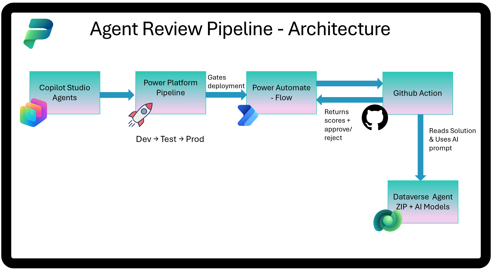

# Agent Review Pipeline

Automated quality gate for Copilot Studio agents deployed via Power Platform Pipelines.

Evaluates agents against design best practices using deterministic pattern detection and AI-powered analysis, then approves or rejects the deployment based on a configurable score threshold.

## How It Works

1. **Power Platform Pipeline** triggers a pre-deployment step
2. **Power Automate Flow** dispatches a GitHub Actions workflow via webhook
3. **GitHub Action** downloads the solution ZIP, parses agent configuration, runs AI evaluation, scores, and generates a PDF report
4. **Callback** returns scores to the flow, which approves or rejects the pipeline stage

## What Gets Evaluated

| Stage | Method | What it checks |
|-------|--------|----------------|
| Parse & Detect | Deterministic | Missing model names, descriptions, variable naming, excessive tools |
| Design Patterns | AI (PredictV2) | Topic design, knowledge sources, conversation flow, error handling |
| Instruction Compliance | AI (PredictV2) | Whether agent follows its own system instructions |

## Setup

**📖 [CI/CD Setup Guide](docs/Agent%20Review%20Pipeline%20-%20CICD%20Setup%20Guide.md)** — step-by-step instructions for your organization.

## License

Part of the [Copilot Studio Kit](https://github.com/Ramakrishnan24689/Power-CAT-Copilot-Studio-Kit).
